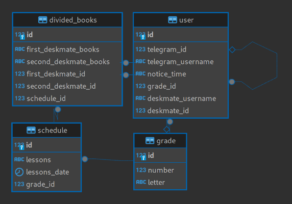

# schedule-book-bot

## Description

schedule-book-bot is a Telegram bot for school students that helps you:
 - Always stay up-to-date with the current class schedule.
 - Easily split textbooks with your desk mate.
 - Receive reminders about which textbooks to bring and notifications about schedule changes.

## Problem
 - Frequent changes in the school schedule.
 - Inconvenience when splitting textbooks with a desk mate.

## Solution
The bot provides the following features:

 - Automatic textbook distribution between desk mates based on the current schedule. Each user receives a notification about which textbooks to bring.
 - Manual textbook distribution: one user selects textbooks, and the other receives a notification with their list.
 - View the current schedule in a convenient format and receive notifications when it changes.
 - Flexible desk mate management: you can change your desk mate or use the bot without one.

## Architecture
 - Telegram bot — the main user interface.
 - Database — stores users, schedules, textbooks, and distributions.
 - Mail parser — automatically receives new versions of the schedule as Excel files.
 - Excel parser — extracts data from the schedule for further processing.

## Database Structure


## Technologies
 - Python 3.12
 - PostgreSQL
 - Aiogram 3
 - SQLAlchemy 2
 - Docker Compose

## Quick Start
 - Create a .env file based on .env.example and fill in all required variables.
 - Start the project with the command:
```bash
make all
```